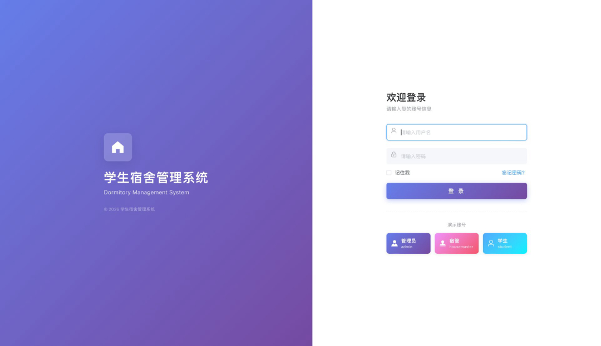
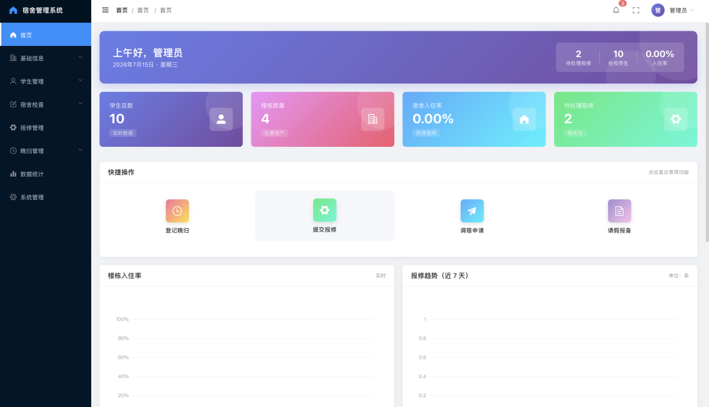
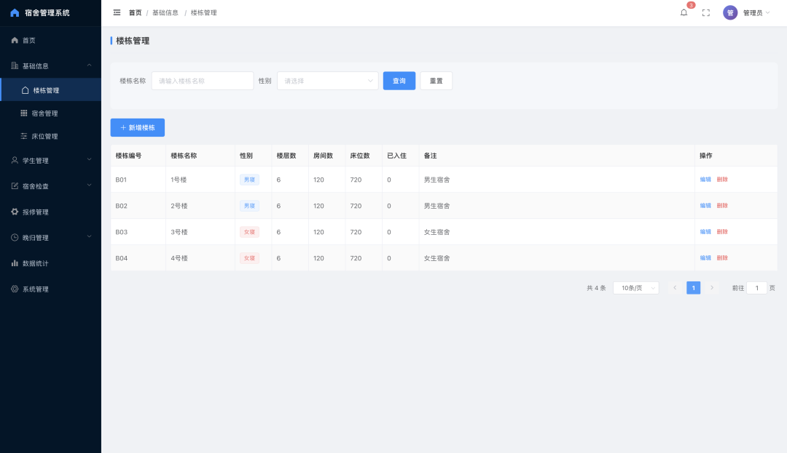
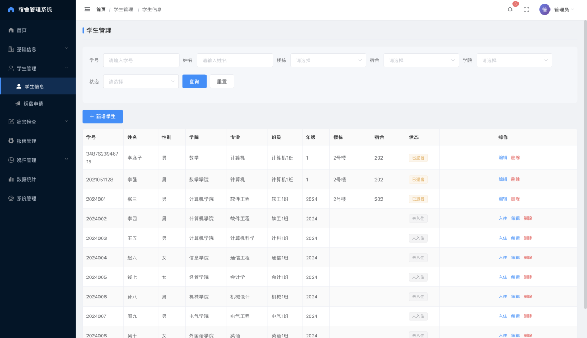
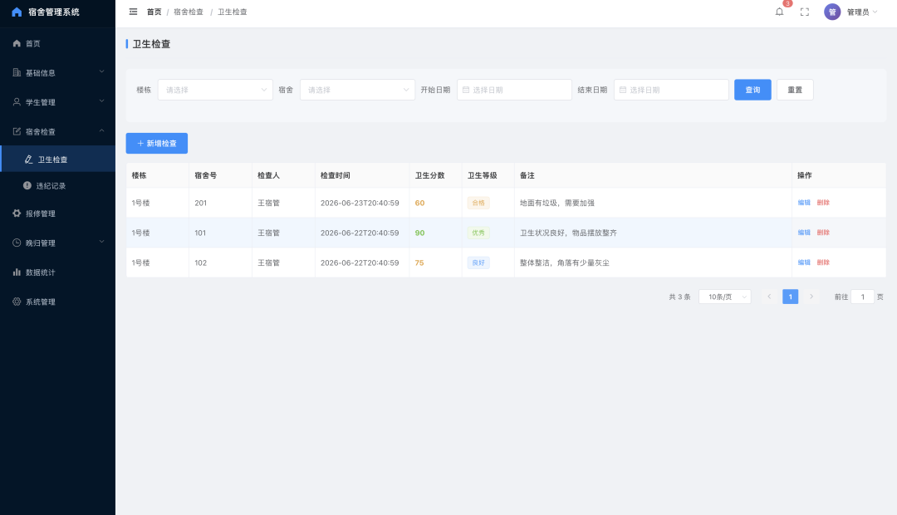
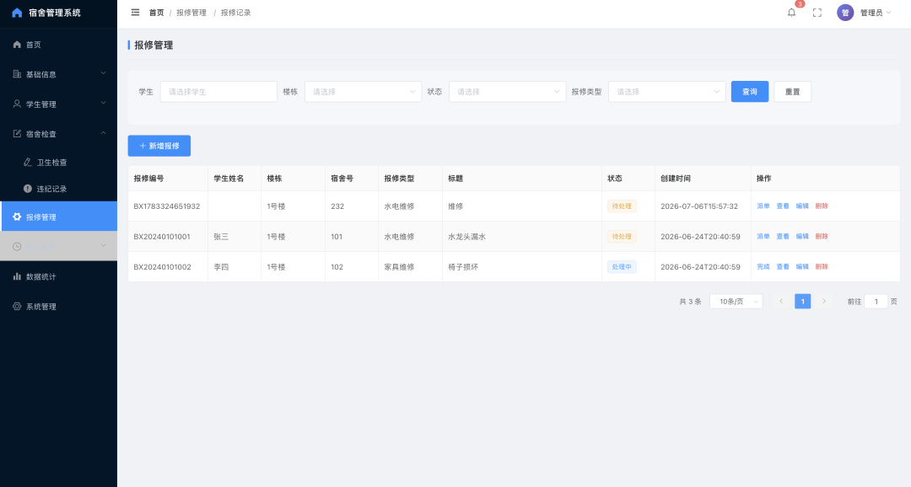
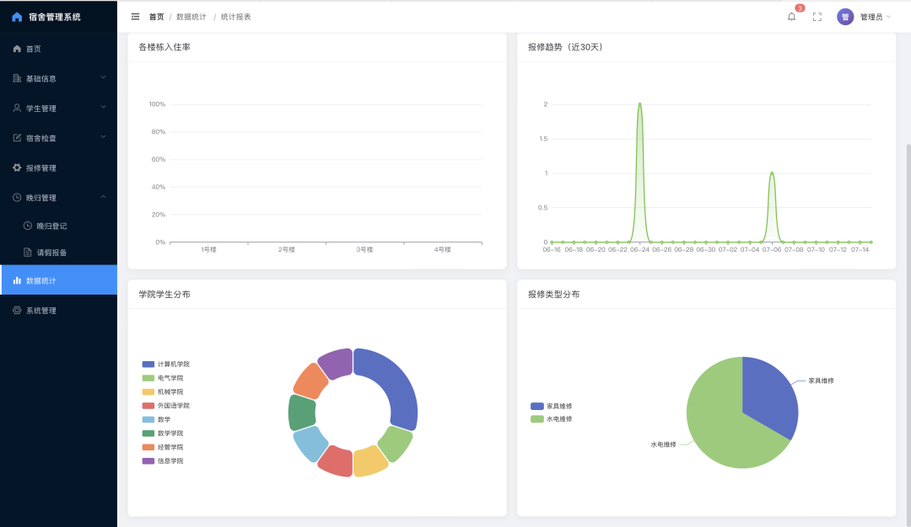
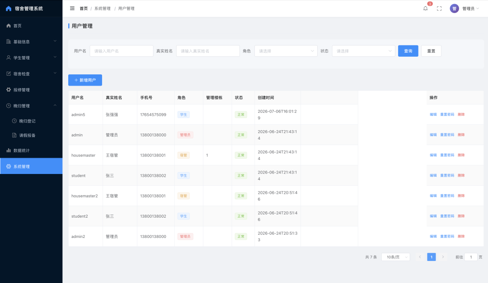

# 🏠 学生宿舍管理系统

> 基于 Spring Boot + Vue 2 的前后端分离宿舍管理系统，覆盖高校宿舍日常管理的完整业务流程。

[](https://spring.io/projects/spring-boot)
[](https://vuejs.org/)
[](https://element.eleme.io/)
[](https://baomidou.com/)
[](./LICENSE)

---

## 📖 项目简介

本系统面向高校宿舍管理场景，提供**学生入住、调宿、报修、查寝、违规登记、晚归登记、请假报备**等核心业务功能，并支持**数据统计可视化**。

### 角色划分

| 角色 | 权限说明 |
|------|----------|
| 管理员（ADMIN） | 全部功能：学生/楼栋/宿舍/床位管理、审批、统计、系统用户管理 |
| 宿舍管理员（HOUSEMASTER） | 学生管理、卫生检查、违纪记录、晚归登记 |
| 学生（STUDENT） | 查看个人信息、提交调宿/报修/请假/晚归申请 |

---

## 📸 系统截图

### 登录页



### 首页控制台


### 楼栋管理


### 学生管理


### 卫生检查


### 报修管理


### 数据统计


### 用户管理


---

## 🛠 技术栈

### 后端

| 技术 | 版本 | 说明 |
|------|------|------|
| Spring Boot | 2.7.18 | 基础框架 |
| MyBatis-Plus | 3.5.3.1 | ORM 持久层 |
| MySQL | 8.0 | 关系数据库 |
| Spring Security + JWT | - | 认证与鉴权 |
| Redis | - | 缓存与 Token 管理 |
| Hutool | 5.8.20 | Java 工具库 |
| Apache POI | 4.1.2 | Excel 导入导出 |
| Lombok | - | 简化代码 |

### 前端

| 技术 | 版本 | 说明 |
|------|------|------|
| Vue | 2.6.14 | 前端框架 |
| Element UI | 2.15.12 | UI 组件库 |
| Vue Router | 3.5.1 | 路由管理 |
| Vuex | 3.6.2 | 状态管理 |
| Axios | 0.27.2 | HTTP 请求 |
| ECharts | 5.4.0 | 数据图表 |
| SCSS | - | 样式预处理 |

---

## ✨ 功能清单

### 🔐 系统管理
- 用户登录 / 注销（JWT Token 认证）
- 角色权限控制（ADMIN / HOUSEMASTER / STUDENT）
- 系统用户管理（仅管理员）

### 🏢 基础信息
- **楼栋管理**：楼栋信息增删改查
- **宿舍管理**：按楼栋管理房间信息
- **床位管理**：床位分配与状态（空闲/占用）

### 👨‍🎓 学生管理
- 学生信息增删改查，支持按学院/年级/专业筛选
- 调宿申请提交与审批
- 学生与房间/床位绑定

### 📋 宿舍检查
- **卫生检查**：日常查寝记录登记与查询
- **违纪记录**：违规行为登记与处理

### 🔧 报修管理
- 学生提交报修申请
- 管理员派单 → 维修完成 → 评价
- 全流程状态追踪

### 🌙 晚归管理
- 晚归情况登记
- 请假报备提交与审批

### 📊 数据统计
- 基于 ECharts 的可视化报表
- 宿舍入住率、报修趋势、学院学生分布、报修类型分布

---

## 📂 项目结构

```
dorm-system/
│
├── dorm-backend/                        # 后端（Spring Boot）
│   ├── src/main/java/com/dorm/
│   │   ├── config/                      # Spring 配置类
│   │   ├── controller/                  # 控制器（13 个）
│   │   │   ├── AuthController
│   │   │   ├── BedController
│   │   │   ├── BuildingController
│   │   │   ├── ChangeRoomRequestController
│   │   │   ├── CheckRecordController
│   │   │   ├── DormRoomController
│   │   │   ├── LateReturnController
│   │   │   ├── LeaveRequestController
│   │   │   ├── RepairController
│   │   │   ├── StatisticsController
│   │   │   ├── StudentController
│   │   │   ├── SysUserController
│   │   │   └── ViolationRecordController
│   │   ├── entity/                      # 实体类
│   │   ├── mapper/                      # MyBatis Mapper
│   │   ├── security/                    # Spring Security + JWT
│   │   ├── service/                     # 业务接口
│   │   │   └── impl/                    # 业务实现
│   │   └── common/                      # 通用工具
│   ├── src/main/resources/
│   │   ├── application.yml              # 应用配置
│   │   └── dorm.sql                     # 数据库初始化脚本
│   └── pom.xml
│
├── dorm-frontend/                       # 前端（Vue 2）
│   ├── src/
│   │   ├── api/                         # 接口封装
│   │   ├── assets/styles/               # 全局样式
│   │   ├── layout/                      # 主布局
│   │   ├── router/                      # 路由配置
│   │   ├── store/                       # Vuex 状态管理
│   │   ├── utils/                       # 工具函数
│   │   └── views/
│   │       ├── dashboard/               # 首页控制台
│   │       ├── login/                   # 登录页
│   │       ├── building/                # 楼栋管理
│   │       ├── room/                    # 宿舍管理
│   │       ├── bed/                     # 床位管理
│   │       ├── student/                 # 学生信息 + 调宿申请
│   │       ├── check/                   # 卫生检查 + 违纪记录
│   │       ├── repair/                  # 报修管理
│   │       ├── late/                    # 晚归 + 请假
│   │       ├── statistics/              # 数据统计
│   │       └── system/                  # 用户管理
│   ├── package.json
│   └── vue.config.js
│
├── docs/images/                         # 文档截图
├── .gitignore
└── README.md
```

---

## 🚀 快速开始

### 环境要求

| 工具 | 最低版本 |
|------|----------|
| JDK | 1.8+ |
| Maven | 3.6+ |
| Node.js | 14+ |
| MySQL | 8.0+ |
| Redis | 5.0+ |

### 1️⃣ 数据库初始化

```bash
mysql -u root -p
CREATE DATABASE dorm_db DEFAULT CHARSET utf8mb4 COLLATE utf8mb4_unicode_ci;
USE dorm_db;
SOURCE dorm-backend/src/main/resources/dorm.sql;
```

### 2️⃣ 配置后端

修改 `dorm-backend/src/main/resources/application.yml`：

```yaml
spring:
  datasource:
    url: jdbc:mysql://localhost:3306/dorm_db?useUnicode=true&characterEncoding=utf-8&useSSL=false&serverTimezone=Asia/Shanghai&allowPublicKeyRetrieval=true
    username: root
    password: 你的数据库密码

  redis:
    host: localhost
    port: 6379
```

### 3️⃣ 启动后端

```bash
cd dorm-backend
mvn spring-boot:run
```

后端运行在：**http://localhost:9090**

### 4️⃣ 启动前端

```bash
cd dorm-frontend
npm install
npm run serve
```

前端运行在：**http://localhost:8080**

> 前端开发服务器配置了代理 `/api` → `http://localhost:9090`，无需手动处理跨域。

---

## 🔑 默认账号

| 角色 | 账号 | 密码 | 说明 |
|------|------|------|------|
| 管理员 | admin | 123456 | 拥有全部权限 |
| 学生 | student | 123456 | 学生角色示例 |

> 具体账号以 `dorm.sql` 初始化脚本中的数据为准。

---

## 📦 打包部署

### 后端打包

```bash
cd dorm-backend
mvn clean package -DskipTests
java -jar target/dorm-backend-1.0.0.jar
```

### 前端打包

```bash
cd dorm-frontend
npm run build
# 生成的静态文件在 dist/ 目录，部署到 Nginx 即可
```

---

## 📝 License

本项目采用 [MIT License](https://opensource.org/licenses/MIT) 开源协议。
